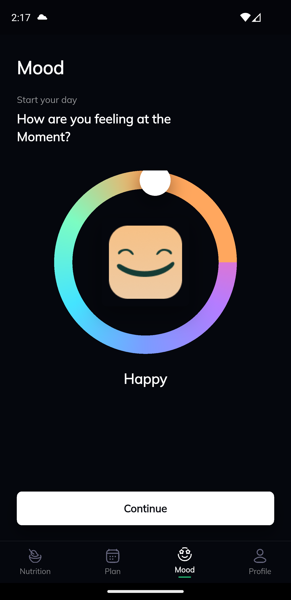
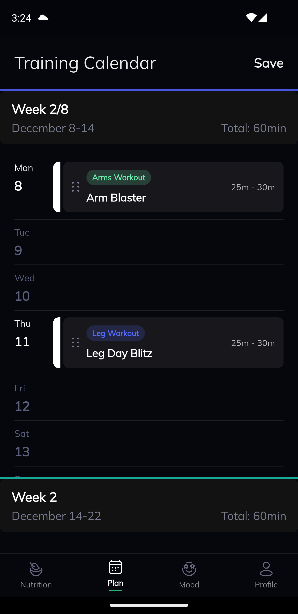
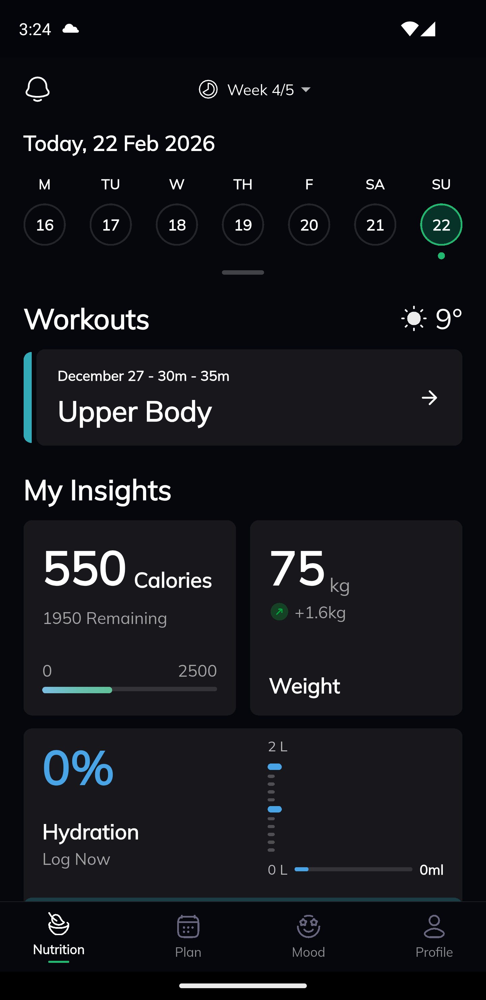
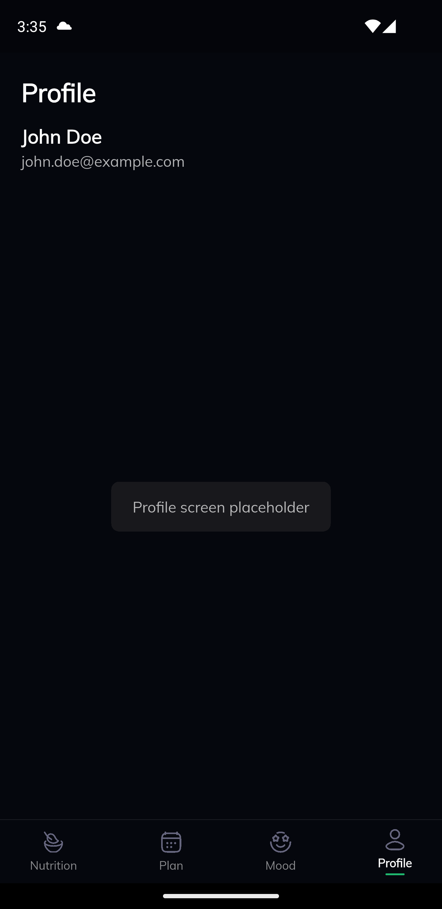

## Dependencies Used & Why

- flutter_screenutil: For responsive sizing (width/height/font) across different screen sizes.
- flutter_svg: To display SVG icons and illustrations.
- provider: For state management
- google_fonts: To apply Google Fonts.


## Project Structure

```text
lib/
  main.dart                 # App entry point, sets up theme, navigation, providers

  core/
    utils/
      app_colors.dart       # Centralized color palette used across the app

  common/
    widgets/
      ui_image.dart         # Shared image widget with common configuration

  generated/
    assets.dart             # Generated assets file  

  features/
    bottom_nav/
      presentations/
        providers/
          bottom_nav_provider.dart   # Manages current bottom navigation index
        screens/
          bottom_nav.dart            # Root scaffold with bottom navigation bar
        widgets/
          bottom_nav_bar_widget.dart # Custom bottom navigation bar UI

    mood/
      presentation/
        providers/
          mood_provider.dart         # Mood state (label, knob angle, etc.)
        screens/
          mood_screen.dart           # Mood screen UI
        widgets/
          mood_ring.dart             # Custom mood ring, knob, and mood image widget

    nutrition/
      presentation/
        providers/
          nutrition_provider.dart    # Nutrition/hydration related state
        screens/
          nutrition_screen.dart      # Nutrition overview screen
        widgets/
          nutrition_widgets.dart     # Nutrition cards (hydration, etc.)

    plan/
      presentation/
        providers/
          plan_provider.dart         # Plan data and drag-and-drop logic
        screens/
          plan_screen.dart           # Workout plan overview screen
        widgets/
          plan_widgets.dart          # Plan cards, headers, and day rows

    profile/
      presentation/
        providers/
          profile_provider.dart      # Profile-related state
        screens/
          profile_screen.dart        # Profile screen UI
        widgets/
          profile_header.dart        # Profile header widget
```


## App Screenshots





```

**4. App Video**
 
1. Record a short screen recording (e.g. via Android Studio emulator recorder or any screen recorder).
2. Save it as `app-demo.mp4` (or similar).
3. You have two common options:

   - **Option A – GitHub (recommended if file is small enough):**
     - Create a `media/` folder and place the video there.
     - Commit and push.
     - Link in README:

       ```markdown
       ## App Video

       [Watch App Demo](media/app-demo.mp4)
       ```

   - **Option B – Google Drive (if video is large):**
     - Upload the video to Google Drive.
     - Make it accessible via “Anyone with the link”.
     - Put the share URL in the README:

       ```markdown
       ## App Video

       [Watch App Demo](https://drive.google.com/file/d/XXXX/view)
       ```

     Replace `XXXX` with the real file id from your Drive link (the example in the task is a dummy URL and does not point to a real file).

---

**5. App APK**

To provide a downloadable APK:

1. Build the release APK locally:

   ```bash
   flutter build apk --release
   ```

   That will generate:

   ```text
   build/app/outputs/flutter-apk/app-release.apk
   ```

2. Create a GitHub Release:

   - Go to your repo on GitHub.
   - Click “Releases” → “Draft a new release”.
   - Tag (e.g. `v1.0.0`) and title it (e.g. `First release`).
   - Upload `app-release.apk` as a binary asset to that release.
   - Publish the release.

3. After publishing, GitHub gives you a direct download URL like:

   ```text
   https://github.com/<your-username>/<your-repo>/releases/download/v1.0.0/app-release.apk
   ```

   (The example `https://github.com/username/project-name/releases/download/v1.0/app-release.apk`
   from your instructions is just a sample and currently leads to a “Page not found”.)

4. Put that link into your README:

```markdown
## App APK

Download the latest Android APK:

[Download app-release.apk](https://github.com/<your-username>/<your-repo>/releases/download/v1.0.0/app-release.apk)
```


## 3. App Screenshots

Screenshots are located in the [`screenshots/`](screenshots/) folder.


---

## 4. App Video

You can watch a short demo of the app here:

[App Demo Video](https://drive.google.com/file/d/1EgZnIk1N9N3xYMKoTat06qu3iTmr4GEP/view?usp=sharing)
<!-- Or use a GitHub-hosted video if preferred -->

---

## 5. App APK

Download the release APK for Android:

[Download app-release.apk](https://github.com/abdullahwaheed12/flutter_test_project/releases/download/v1.0.0/app-release.apk)

---

## 6. How to Run

```bash
flutter pub get
flutter run
```

Requires Flutter SDK `^3.9.2` as configured in `pubspec.yaml`.
```